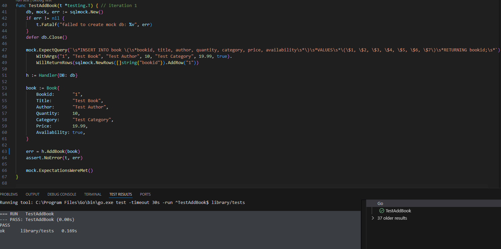
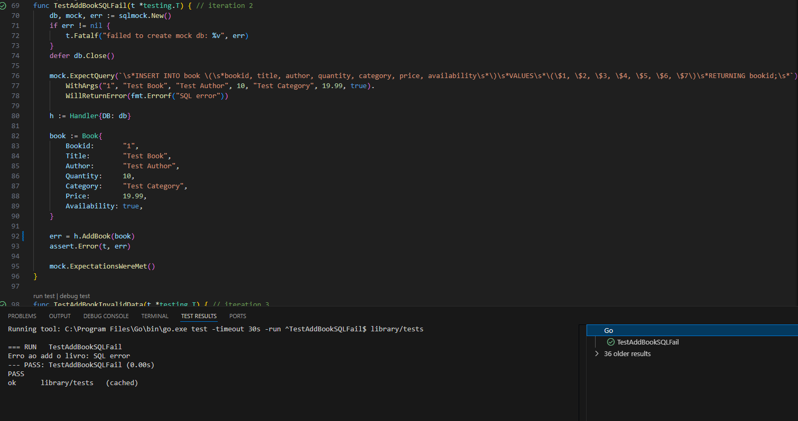
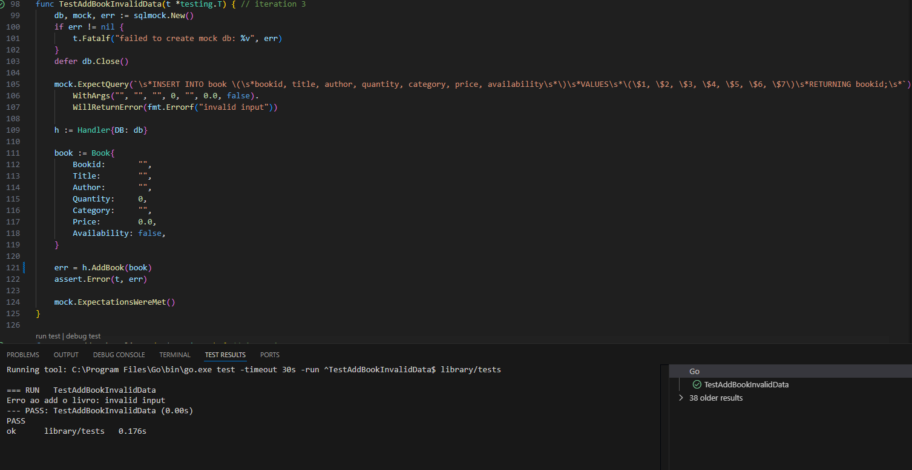
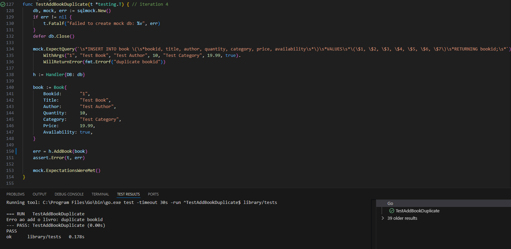
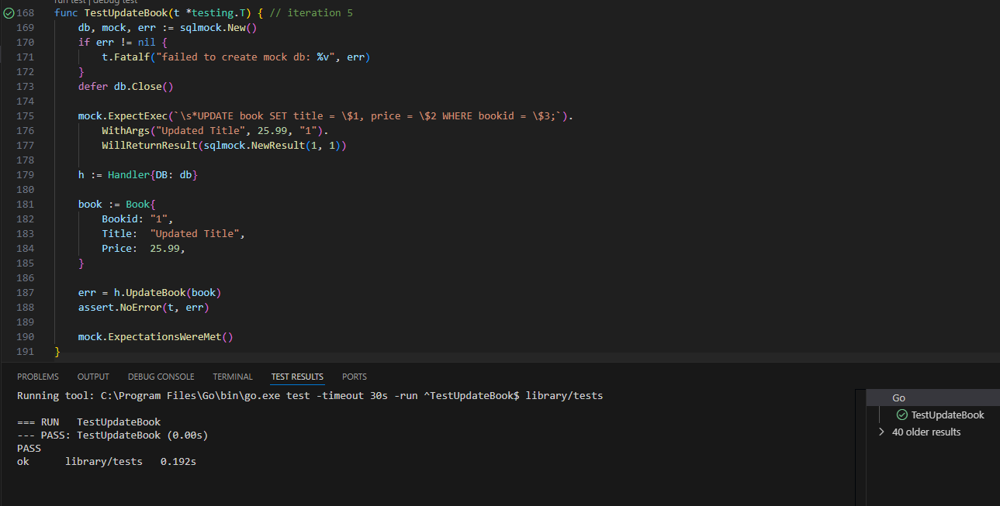
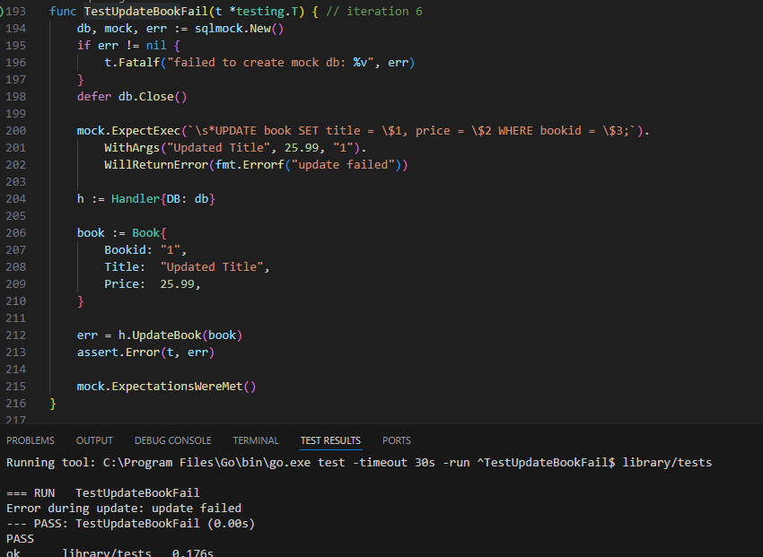
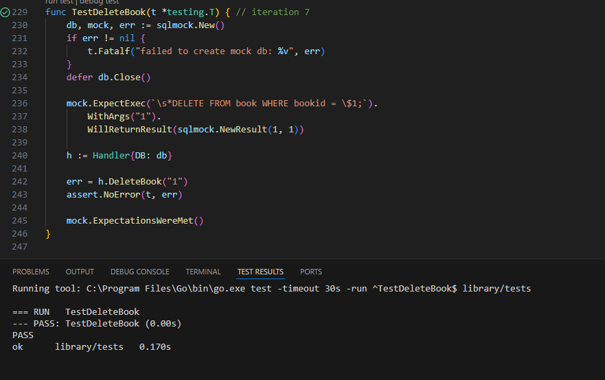
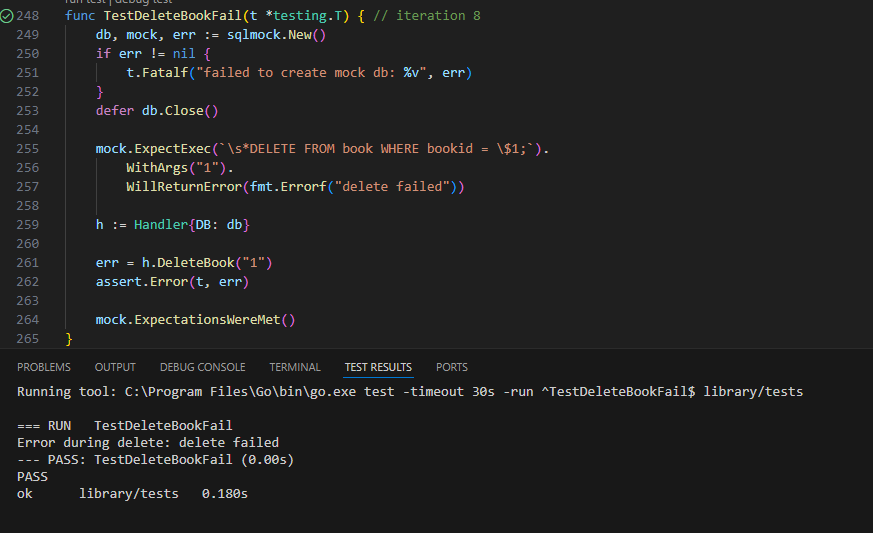
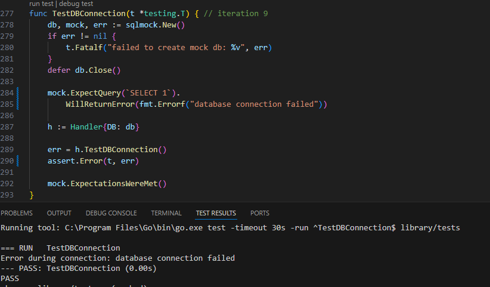
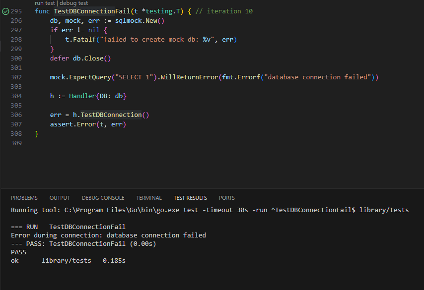

# library_api web-2

# START DB and API IN BACKGROUND
    docker-compose up -d

# STOP DB and API
    docker-compose down

# START API
    go mod tidy  
    cd cmd/ 
    go run main.go 

# Build project
    docker build -f Dockerfile -t library_api:1.0 .
    docker run -p 8080:8080 library_api:1.0

## test 1

## test 2

## test 3

## test 4

## test 5

## test 6

## test 7

## test 8

## test 9

## test 10

